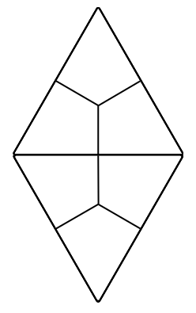
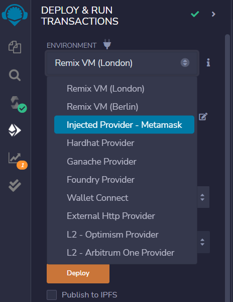

# ⚛️ cra-template-solidity

> A Ethereum starter kit for rapid development of the proof of concept solidity app

[](https://npmjs.org/package/cra-template-solidity)

A starter kit build especially for rapid smart contract development in [Remix IDE](https://remix-project.org/). Once you wrote your Solidity smart contract in Remix you could easely deploy it into global [testnet](https://ethereum.org/en/developers/docs/networks/) or local [Ganache](https://trufflesuite.com/ganache/) blockchain [by using a UI](https://www.linkedin.com/pulse/using-ganache-ethereum-emulator-metamask-farhan-khan/). After that simple copy and paste smart conract address into [params.ts](./template/src/config/params.ts)



## Usage

> Create an app from template

```bash
npx create-react-app . --template=solidity
```

> Deploy smart contract to [Ganache](https://trufflesuite.com/ganache/) and update [config file](./template/src/config/params.ts) ([also update ABI if you changed it](https://www.geeksforgeeks.org/application-binary-interfaceabi-in-ethereum-virtual-machine/)). The path is `~/src/config/params.ts`

```tsx
export const CC_CONTRACT_ADDRESS = /*process.env.REACT_APP_CONTRACT ||*/ '0xec7e48D6Fb993d532B0aA2E0393461680D7ab83f';
export const CC_APP_NAME = 'HashApp';
export { default as CC_CONTRACT_ABI } from "../contract/ABI.json";
```


## Contains boilerplate for

1. **MetaMask Connection request**

2. **Network ID check**

3. **Contract deployment status check by address**

4. **Sample counter smart contract**

5. **Simple config by variable with smart contract address in source code**

## What's inside

1. [ethers.js](https://docs.ethers.io/v5/)
2. [TypeScript](https://www.typescriptlang.org/)
3. [MUI](https://mui.com/)
4. [Mobx](https://mobx.js.org/)
5. [react-declarative](https://www.npmjs.com/package/react-declarative)
6. [tss-react](https://www.npmjs.com/package/tss-react)


## Code samples

> Solidity

```solidity

// SPDX-License-Identifier: GPL-3.0

pragma solidity ^0.8.7;

contract TodoList {

    struct Todo {
        uint id;
        string content;
        address owner;
        bool isDeleted;
    }

    uint256 public lastTodoId;

    mapping (uint256 => Todo) public todoMap;

    function todosOfOwner() public view returns (uint256[] memory) {
        uint256 todosLength = lastTodoId + 1;
        uint256[] memory ownedTodoDirtyIds = new uint256[](todosLength);
        uint256 ownedTodoIdx = 0;
        for (uint id = 0; id != todosLength; id++) {
            Todo memory todo = todoMap[id];
            if (todo.owner == msg.sender && !todo.isDeleted) {
                ownedTodoDirtyIds[ownedTodoIdx] = todo.id;
                ownedTodoIdx++;
            }
        }
        uint256[] memory ownedTodoIds = new uint256[](ownedTodoIdx);
        for (uint id = 0; id != ownedTodoIdx; id++) {
            ownedTodoIds[id] = ownedTodoDirtyIds[id];
        }
        return ownedTodoIds;
    }

    function addTodo(string memory _content) public {
        uint256 currentId = lastTodoId++;
        Todo memory todo;
        todo.id = currentId;
        todo.content = _content;
        todo.owner = msg.sender;
        todoMap[currentId] = todo;
    }

    function removeTodo(uint256 _id) public {
        Todo storage todo = todoMap[_id];
        require(todo.owner == msg.sender, 'You are not the owner of that todo');
        todo.isDeleted = true;
    }

}

```

> TypeScript

```tsx
import { makeAutoObservable, runInAction } from "mobx";
import { inject, singleshot } from "react-declarative";

import {
    ethers,
    BaseContract
} from "ethers";

import EthersService from "./EthersService";

import { CC_CONTRACT_ADDRESS } from "../../config/params";
import { CC_CONTRACT_ABI } from "../../config/params";

import TYPES from "../types";

type IContract = BaseContract & Record<string, (...args: any[]) => Promise<any>>;

export class ContractService {

    readonly ethersService = inject<EthersService>(TYPES.ethersService);

    private _instance: IContract = null as never;

    get isContractConnected() {
        return !!this._instance;
    };

    constructor() {
        makeAutoObservable(this);
    };

    getLastTodoId = async () => Number(await this._instance.lastTodoId());

    getTodoById = async (id: number) => {
        const todoItem = await this._instance.todoMap(id);
        return {
            id: Number(todoItem.id),
            content: String(todoItem.content),
            owner: String(todoItem.owner),
            isDeleted: Boolean(todoItem.isDeleted),
        };
    };

    addTodo = async (content: string) => await this._instance.addTodo(content);

    removeTodoById = async (id: number) => await this._instance.removeTodo(id);

    todosOfOwner = async () => {
        const todoIds: number[] = (await this._instance.todosOfOwner()).map((bigint: any) => Number(bigint));
        return await Promise.all(todoIds.map((id) => this.getTodoById(id)));
    };

    todosOfEveryone = async () => {
        const lastId = await this.getLastTodoId();
        const totalIds = [...Array(lastId).keys()];
        return await Promise.all(totalIds.map((id) => this.getTodoById(id)));
    };

    prefetch = singleshot(async () => {
        console.log("ContractService prefetch started");
        try {
            const deployedCode = await this.ethersService.getCode(CC_CONTRACT_ADDRESS);
            if (deployedCode === '0x') {
                throw new Error('ContractService contract not deployed');
            }
            const instance = new ethers.Contract(
                CC_CONTRACT_ADDRESS,
                CC_CONTRACT_ABI,
                this.ethersService.getSigner(),
            ) as IContract;
            runInAction(() => this._instance = instance);
        } catch (e) {
            console.warn('ContractService prefetch failed', e);
        }
    });

}

```


## See also

This starter kit is build on top of [react-declarative](https://www.npmjs.com/package/react-declarative) npm package. I think you are going to like the way of reactive programming in this app and you will want bring it to other projects which may not require web3 technologies. So check the [github repo](https://github.com/react-declarative/react-declarative) and seek for other guides
